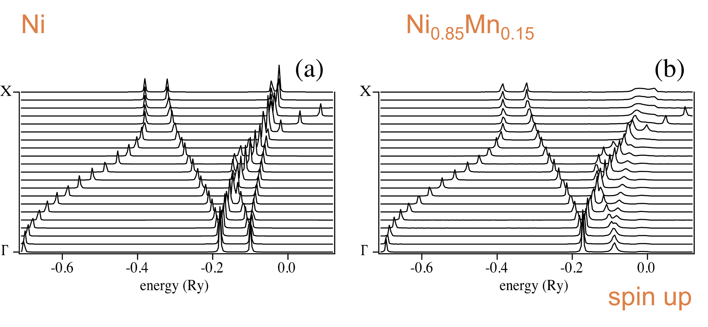
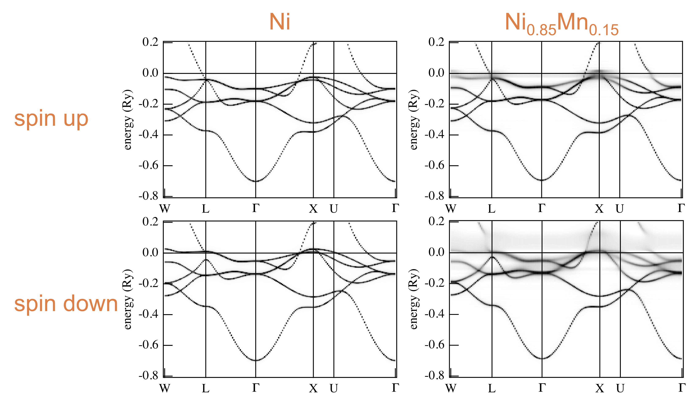
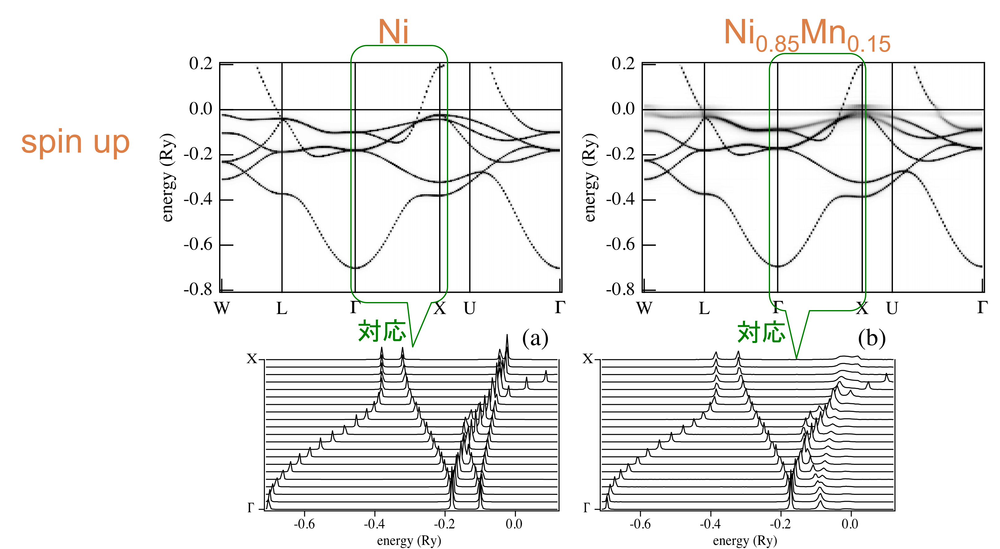
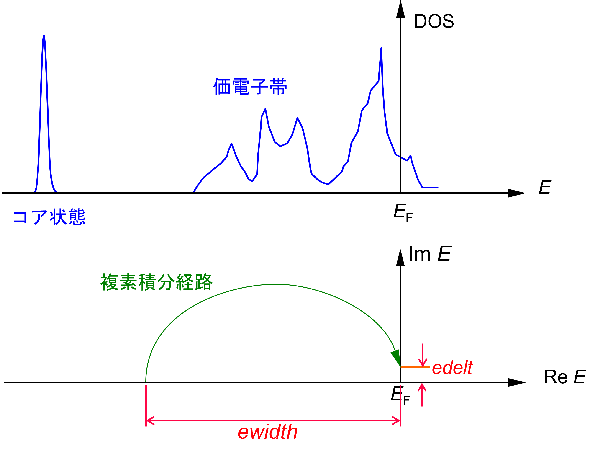

# AkaiKKR Inputファイルの解説

計算モードを"go"と指定することにより、最も基本的であるSCF計算が実行できる。ここでは、計算モードを"go"と指定するときのInputについて解説する。

## Inputファイルの構成
Inputファイルには主に結晶格子に関する情報が書かれる。まず、Inputファイルの記述例を示したい。

```in/fe
c----------------------Fe------------------------------------
c    go   file
     go   data/fe
c------------------------------------------------------------
c   brvtyp     a        c/a   b/a   alpha   beta   gamma
     bcc      5.27  ,      ,      ,      ,       ,      ,
c------------------------------------------------------------
c   edelt    ewidth    reltyp   sdftyp   magtyp   record
    0.001     1.0       nrl      mjw      mag      2nd
c------------------------------------------------------------
c   outtyp    bzqlty   maxitr   pmix
    update      4        50    0.023
c------------------------------------------------------------
c    ntyp
      1
c------------------------------------------------------------
c   type    ncmp    rmt    field   mxl  anclr   conc
    Fe       1       1      0.0     2
                                          26    100
c------------------------------------------------------------
c   natm
     1
c------------------------------------------------------------
c   atmicx                        type
     0          0          0        Fe
c------------------------------------------------------------
```

この中で、**cまたは#から始まる行はコメント行**であり、計算の際には読み込まれない。また、**空行は読み飛ばされる。**
この例には含まれていないが、ひとつのファイルの中に複数のInputファイルを続けて書いておくと計算は順番に実行される。また、コメントアウトされていない**end**を読み取ると、以降の記述は読み込まれない。

実際にコメント行と空白を読み飛ばすと次のようになる。プログラムは、このような状態のInputを読み込んでいる。

```in/fe
go   data/fe

bcc      5.27  ,      ,      ,      ,       ,      ,
0.001     1.0       nrl      mjw      mag      2nd
update      4        50    0.023
1
Fe       1       1      0.0     2
                                          26    100
1
0          0          0        Fe
```

読みやすさのためにコメント行やキーワード名が記述されていることに注意されたい。**プログラム上は、1個以上の空白またはカンマがデータの区切りとなる。** 連続する空白は1個の空白と同じ意味を持つ。改行も同様である。また、どこで改行してもよい。さらに省略された状態を次に示す。

```in/fe
go data/fe bcc 5.27,,,,,,0.001 1.0 nrl mjw mag 2nd
update 4 50 0.023 1 Fe 1  1  0.0 2 26 100
1 0 0 0 Fe
```
Inputとして読み込まれるものは順序付けられたデータの並びであるので、記述する順番さえ守ればよい。ほとんど全ての**データやキーワードは省略可能**だが、**省略したことを示すために、データ区切りのカンマをいれておく。**
また、Inputは必ずしもファイルとして用意する必要はない。実際には、ターミナル上でAkaiKKRプログラムを起動した際に、キーボードからの標準入力で記述すれば、計算を行うことが出来る。

```direct_input
> specx (or ./specx, run specx, etc.)
go
data/fe
bcc 
5.27,,,,,,
0.001 1.0 nrl mjw mag 2nd
update 4 50 0.023 1 Fe 1  1  0.0 2 26 100
1 0 0 0 
Fe
(計算開始)
...
Ctl-d
>
```
実際のところはInputファイルを準備して計算するほうが便利だろう。

## キーワード解説
コメント行でpartをわけているものとして、以下キーワードの解説を行う。

```in/fe
c----------------------Fe------------------------------------
c    go   file
     go   data/fe
c------------------------------------------------------------
c   brvtyp     a        c/a   b/a   alpha   beta   gamma
     bcc      5.27  ,      ,      ,      ,       ,      ,
c------------------------------------------------------------
c   edelt    ewidth    reltyp   sdftyp   magtyp   record
    0.001     1.0       nrl      mjw      mag      2nd
c------------------------------------------------------------
c   outtyp    bzqlty   maxitr   pmix
    update      4        50    0.023
c------------------------------------------------------------
c    ntyp
      1
c------------------------------------------------------------
c   type    ncmp    rmt    field   mxl  anclr   conc
    Fe       1       1      0.0     2
                                          26    100
c------------------------------------------------------------
c   natm
     1
c------------------------------------------------------------
c   atmicx                        type
     0          0          0        Fe
c------------------------------------------------------------
```

### part1 計算を実行する

```in/fe
c----------------------Fe------------------------------------
c    go   file
     go   data/fe
c------------------------------------------------------------
```

#### go : 走らせる計算の種類

走らせる計算の種類を決定する。利用できるキーワードは以下の通り。

* go : SCF計算の開始
* dos : 状態密度計算
* spc : エネルギー分散の計算
* ngo : 何もしない
* dsp : 既にある計算の結果を表示する

主要な略語の意味はそれぞれ、SCF (自己撞着場 self-consistent field)、dos (状態密度 density of states)、spc (ブロッホ・スペクトル関数 Bloch spectral function)である。

#### file : 利用するデータの保存されている場所

これは、どのようなファイル、ディレクトリでもよい。また、存在しないファイルでもよい。
初めてAkaiKKRをダウンロードして解凍した場合は、dataディレクトリには何も入っていない。dataディレクトリは、計算結果を保存するのに一般的に使う場所としてとらえておけばよい。

fileが存在する場合はアウトプットに
```
file to be accessed=data/fe


```
とだけ表示される。存在しないファイルを指定して計算を走らせた場合は、
```
file to be accessed=data/fe

created
```
このように表示され、同じ名前のfileが生成される。例えば、**go**を使ってSCF計算を行って、新しいfileを作成したのちに、SCF計算で保存されたfileを用いて**dos**計算を走らせることが可能である。

##### ブロッホ・スペクトル関数
ブロッホ・スペクトル関数に関する簡易的な補足を行う。
例えば、NiとNiMn合金のブロッホ・スペクトル関数は次のようになる。

エネルギー分散は次のようになる。


ブロッホ・スペクトル関数とエネルギー分散の対応を取ると次のようになる。


### part2 結晶の構造を決定する
キーワードは、結晶の構造を示すものが並んでいる。
```in/fe
c------------------------------------------------------------
c   brvtyp     a        c/a   b/a   alpha   beta   gamma
     bcc      5.27  ,      ,      ,      ,       ,      ,
c------------------------------------------------------------
```
#### brvtyp : ブラベー格子

ここでは次のような構造を指定できる。

* 指定できるキーワード
  * fcc : face centered cubic 面心立方
  * bcc：body centered cubic  体心立方
  * hcp (hex) : hexagonal closed packed  六方稠密
  * sc : simple cubic 単純立方
  * bct : body cnetered tetoragonal 体心正方
  * st : simple tetoragonal 単純正方
  * fco : face centered orthorhombic
  * bco : body centered orthorhombic
  * bso : base centered orthorhombic
  * so : simple orthorhombic
  * bsm : base centered monoclinic
  * sm : simple monoclinic
  * trc : triclinic
  * rhb(trg) : rhombohedral(trigonal)
  * fct : face centered tetragonal

様々に指定が可能である。また、**分からなければブランクでもよい。**
AkaiKKR内にデータベースを備えており、**ブランクの場合はこれを参照して適当に設定される。**

#### a : 格子定数 a

これも分からなければブランクでもよい。理由はbrvtypと同様に、コード内のデータベースを参照できるからである。
なお、**このコードで採用されている単位系はスレータの原子単位系**であり、長さの単位はbohrである。

* 長さ : 1 bohr ≃　0.529 Å
* エネルギー : 1 Ry ≃ 13.6 eV

である。

例えばbrvtypがbcc構造である場合、c/a, b/a, α, β, γ は1, 1, 90, 90, 90と決まっているため、カンマで省略して表記できる。

### part3 複素積分　
```in/fe
c------------------------------------------------------------
c   edelt    ewidth    reltyp   sdftyp   magtyp   record
    0.001     1.0       nrl      mjw      mag      2nd
c------------------------------------------------------------
```
**edelt**と**ewidth**は非常に注意深く決める必要のあるパラメータで、両方とも単位はRyである。



* edelt : ~0.001 フェルミエネルギーに付与される虚数部分。
* ewidth : Energy Contourの幅。どれだけの幅をもって積分するかを示す。

計算失敗の多くはここの不適切な設定に起因する。

**edelt**について、このプログラムで計算される関数は、複素エネルギー上面の正の実軸がブランチカットになっておりGreen関数は定義されない。そこで複素平面上の虚数部分の正の側から実軸に近づいた極限として実エネルギーでのGreen関数が定義される。
数値計算上は有限の虚数部分を与えており、その大きさがedeltである。edeltは大きくすると，少ないk点でも計算はスムーズにいくが、精度が落ちる可能性がある。逆に小さくすると多くのk点が必要となるが、十分多数のk点がとれれば精度は高くなる。そこで「適当な値を見極める」ということが必要になるが、デフォルトの0.001Ryはまず安全な値である。

**ewidth**の決め方は次のようにする。
上図でいうなら、コア状態と価電子帯の中間あたりにくるように設定すると安全である。しかし、コア状態の位置、価電子帯の位置はあらかじめ分かっているものではないため、不適切な幅でewidthを設定してしまうことがある。この場合は計算が失敗してしまうので、注意深く設定する必要がある。

具体的には、フェルミエネルギーからewidthを引いたエネルギーがエネルギー積分の下端となるが、この下端が価電子帯の底より十分下（0.1Ry以上）にあり、しかも浅いコアレベルより十分上（0.1Ry以上）に来るように決める。

**reltyp**は、相対論の扱いを決める。重い原子については原子核に近いあたりで電子の速度は非常に大きくなるために電子を相対論に基づいて取り扱う必要があり、問題によっては軽い原子の場合でも相対論的に取り扱うことがある。以下のキーワードのいずれかを指定する。

* nrl : non relativistic　相対論的効果を全く考慮しない
* sra : scaler relativistic　スピン軌道相互作用以外の相対論効果を入れる。スカラー相対論的と呼ばれる
* scals : sra + スピン軌道相互作用も考慮する

**sdftyp**は、用いるLDA/GGA汎関数を決める。利用可能な交換相関ポテンシャルは例えば次の通りである。
* mjw : Morruzi-Janak-Wiliams
* vbh : von Berth-Hedin
* vwn : Vosko-Wilk-Nusair
* gga91 : generalized gradient approximation 91
* pbe : Perdew-Burke-Ernzerhof

**magtyp**は磁性の取り扱いを決める。
* mag : magnetic　磁性あり。スピンを考慮する。
* nmag : non magnetic　非磁性
* lmd : local moment disordered state　不規則局所磁気モーメント

**record**はポテンシャルデータの利用に関するキーワードである。異常終了などで計算結果が失われてしまわないように、最新の計算結果と、その一つ前のバックアップの、二組のデータが常に保存されている。
* init : 新規ポテンシャルデータ（与えられた原子配置からポテンシャルを計算して利用する）
* 2nd : 最新のポテンシャルデータから計算を続ける
* 1st : 一つ前のデータから計算を続ける

### part4 データの保存とパラメータの収束の指定
```in/fe
c------------------------------------------------------------
c   outtyp    bzqlty   maxitr   pmix
    update      4        50    0.023
c------------------------------------------------------------
```

**outtyp**はポテンシャルデータの保存に関するキーワードである。
* update : ポテンシャルデータを上書き保存する
* quit : 保存しない

ここからはパラメータ値を指定する。
* bzqlty : Brillouin Zone Quality。メッシュの大きさをコントロールする。単位はなく、ブリルアンゾーンのガンマ点(0, 0, 0)から点　ka/2（kaは単位逆格子ベクトル）までをn等分したときのnの値。
* maxitr : 反復計算の最大反復回数。
* pmix : チェビシェフ加速やブロイデン加速に用いるパラメータ。詳しくは後述する。

bzqltyの値は大切で、例えば状態密度を描くときには20以上に設定しておかないと、十分なめらかなバンドが描けないことがある。

**pmix**はポテンシャルの混合に関わるパラメータである。例えば次のような指定の仕方をする。
* 0.023 : 最初チェビシェフそれからブロイデン
* 0.023tch : チェビシェフだけ
* 0.023bry : ブロイデンだけ
* 0.023tchbry : 0.023とするのと同じ、最初チェビシェフそれからブロイデン

ここで使われている数字0.023は収束を制御するパラメータで、一般には大きいほど収束は速い。
単純な系なら0.035くらいで大丈夫であるが、大きなサイズの系では0.001以下にすることもある。

### part5 タイプの数
```in/fe
c------------------------------------------------------------
c    ntyp
      1
c------------------------------------------------------------
```
異なったタイプの位置の数、つまり結晶学的に同等でない位置の数を示す。単位格子中の独立なサイトの種類の数を指す。

### part6 サイトの特徴
```in/fe
c------------------------------------------------------------
c   type    ncmp    rmt    field   mxl  anclr   conc
    Fe       1       1      0.0     2     26    100
c------------------------------------------------------------
```

* type : タイプにつける任意の名前。個々のサイトの種類の名前となる。
* ncmp : typeで指定した位置を占める原子の種類の数。
* rmt : マフィン・ティン半径、単位は格子定数aで、格子定数aの長さの単位はbohrである。0とすると自動的に設定される。
* field : ゼーマンエネルギーで表示した外部磁場。単位はRy。1Ryは2.351x10^5 T

* mxl : 角運動量が大きくなると散乱のt行列は急速にゼロに近づく．角運動量がmxlより小さいt行列はゼロでないとする．
* anclr : typeで指定した位置を占める原子の原子番号。0は空格子点を置くことを意味する。
* conc : その原子がそのタイプの位置を占める確率、あるいは濃度。concentrationはサイト内で規格化されるので総和はいくらになってもよい。

**rmt**(マフィン・ティン半径)について補足すると、この値は意図的に設定するのでなければ、ゼロを指定するか省略しておいてよい。ユニットセルに複数の異なった原子があるときには、コードに備えられたイオン半径のデータベースを参照して、適当な値が設定される。

**field**の値については、反強磁性などの磁気構造を指定したいときには、磁気モーメントの方向が安定するまで反復計算の初期に0.05程度の値を入れる必要がある。

**mxl**の値は、2を指定するとd波の散乱までが考慮される。より精度の高い計算がしたければ3を指定すればf波散乱まで考慮される。

### part7　ユニットセルあたりの原子数
```in/fe
c------------------------------------------------------------
c   natm
     1
c------------------------------------------------------------
```

* natm : ユニットセルあたりの原子数(異なる原子位置の数)

### part8　原子の位置とタイプ名
```in/fe
c------------------------------------------------------------
c   atmicx                        type
     0          0          0        Fe
c------------------------------------------------------------
```

* atmicx : 原子の位置。位置ベクトル。単位格子aを基準とし、単位格子の長さの単位はbohrとなる。二通りの書き方があり、直交座標で指定する時は例えば0.5, 0.5, 0.5などと書き、基本ベクトルで指定する時は0.5a, 0.5b, 0.5c などと書く。
* type : その位置を占めるタイプの名前。

ここでの**type**は、part6の**type**との間に対応が取れていなければならない。旧バージョンでは、**atmtyp**という名前が使われていたが、実質同一であることから、2022年年始のアップデート(cpa2021.tgz January 15, 2023 [ 13:36:45 ])で**atmtyp**から**type**への置き換えが行われた。

### part9　セルに複数の原子がある場合

ここまではセルにサイトが1つで、そのサイトにFeが100%占める場合について示した。このpartではセルに複数原子があり、さらにサイトを占める原子も複数ある場合の例であるFeRh0.5Pt0.5の例を示す。この例は、"[FeRh0.5Pt0.5.cif](https://github.com/AkaiKKRteam/AkaiKKRPythonUtil/blob/master/tests/structure/FeRh0.5Pt0.5.cif)"からAkaiKKRPythonUtilを用いて作成したインプットを編集したものである。

```
c----------------------FeRh0.5Pt0.5------------------------------------
c    go   file
     go   data/ferh0.5pt0.5
c----------------------------------------------------------------------
c   brvtyp         a                c/a         b/a  alpha  beta  gamma
     st    5.204307821390574 1.2817719680464779 1.0  90.0   90.0  90.0
c----------------------------------------------------------------------
c   edelt    ewidth    reltyp   sdftyp   magtyp   record
    0.001     1.0       sra      mjw      nmag     2nd 
c----------------------------------------------------------------------
c   outtyp    bzqlty   maxitr   pmix
    update      6       200     0.02
c----------------------------------------------------------------------
c    ntyp
      2
c----------------------------------------------------------------------
c  　type            ncmp   rmt   field   mxl   anclr    conc
      Fe              1     0.0    0.0     2   
                                                 26     100.0
      Rh0.5Pt0.5      2     0.0    0.0     2
                                                 45      50.0
                                                 78      50.0
c----------------------------------------------------------------------
c    natm
      2
c----------------------------------------------------------------------
c   atmicx                                type
   0.00000000a 0.00000000b 0.00000000c   Fe
   0.50000000a 0.50000000b 0.50000000c   Rh0.5Pt0.5
c----------------------------------------------------------------------
```

上から5,6行目はセルの形状を示している。
```
c----------------------------------------------------------------------
c   brvtyp         a                c/a         b/a  alpha  beta  gamma
     st    5.204307821390574 1.2817719680464779 1.0  90.0   90.0  90.0
c----------------------------------------------------------------------
```
brvtypはst(単純正方格子)で、一つ目の格子ベクトルの長さが5.204307821390574 Bohrである。残りの格子ベクトルについては、1つ目の格子ベクトルの長さとの比で1.2817719680464779, 1.0となっている。格子ベクトル同士のなす角は全て90度である。

上から8行目から12行目に計算条件が示されている。
```
c----------------------------------------------------------------------
c   edelt    ewidth    reltyp   sdftyp   magtyp   record
    0.001     1.0       sra      mjw      nmag     2nd 
c----------------------------------------------------------------------
c   outtyp    bzqlty   maxitr   pmix
    update      6       200     0.02
c----------------------------------------------------------------------
```
先ほどのFeの例と大きく違う所として、reltypにsra(スカラー相対論効果)、magtypにnmag(非磁性)が指定されている。

上から14,15行目に異なったtypeの位置の数、つまり結晶学的に同等でない位置の数が示されている。
```
c----------------------------------------------------------------------
c    ntyp
      2
c----------------------------------------------------------------------
```
ここでは、Feというサイトと、Rhが50%、Ptが50%占めているRh0.5Pt0.5というサイトの2種類があるため、ntypは2である。


上から17行目から22行目に、各typeに対する入力パラメータが書かれている。
```
c----------------------------------------------------------------------
c  　type            ncmp   rmt   field   mxl   anclr    conc
    Fe                1     0.0    0.0     2   
                                                 26     100.0
    Rh0.5Pt0.5        2     0.0    0.0     2
                                                 45      50.0
                                                 78      50.0
c----------------------------------------------------------------------
```
まず1種類目のtypeであるFeの入力パラメータが書かれている。ncmpはそのサイトに占める原子の種類の数であり、ここでは1である。anclr(原子番号)は26で、conc(サイトに原子が占める確率もしくは濃度)は100%である。続いて、2種類目のtypeであるRh0.5Pt0.5の入力パラメータが書かれている。RhとPtがあるためncmpは2である。一つ目のRhについてはanclr(原子番号)は45でconcは50%、二つ目のPtについてはanclrは78でconcは50%である。

上から24行目から29行目に、セル内のサイトについての記述がある。
```
c----------------------------------------------------------------------
c    natm
      2
c----------------------------------------------------------------------
c   atmicx                                type
   0.00000000a 0.00000000b 0.00000000c   Fe
   0.50000000a 0.50000000b 0.50000000c   Rh0.5Pt0.5
c----------------------------------------------------------------------
```
上から24,25行目はセル内のサイトの数でありここでは2である。また、上から26行目から28行目には原子の位置(後ろにa,b,cと書かれており、基本ベクトル指定となっている)とtype名が書かれている。