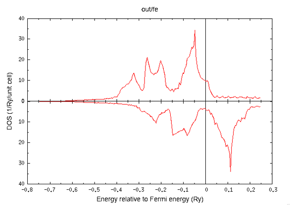
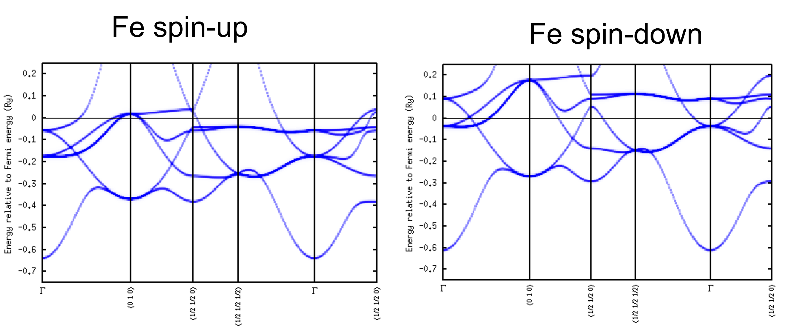
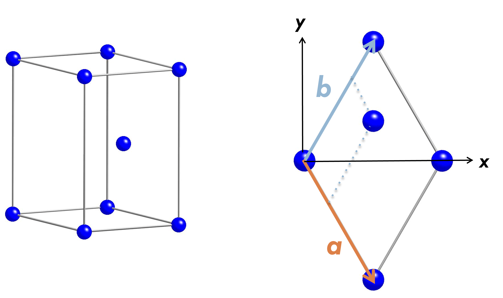
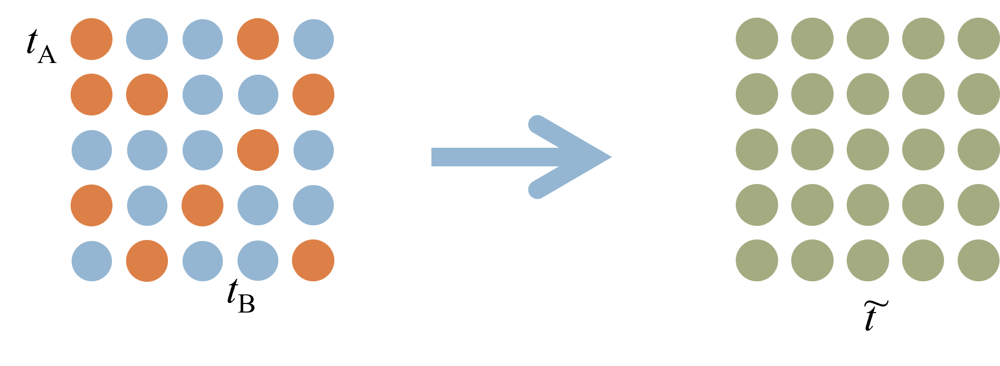
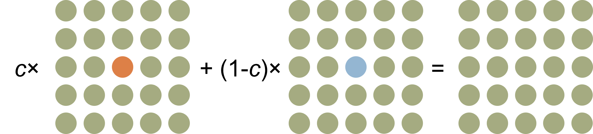
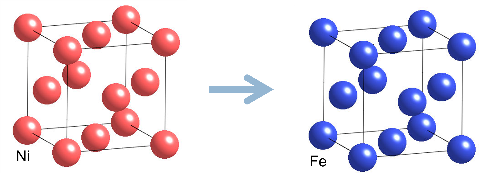
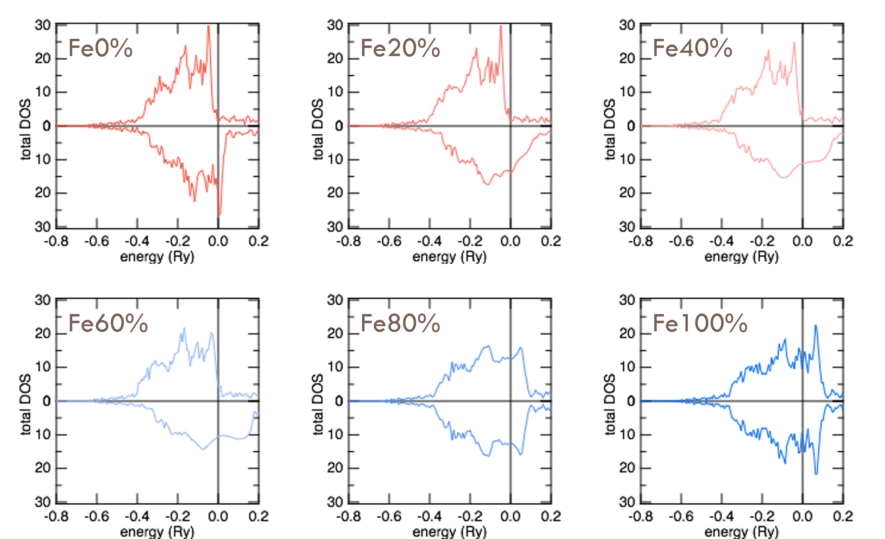
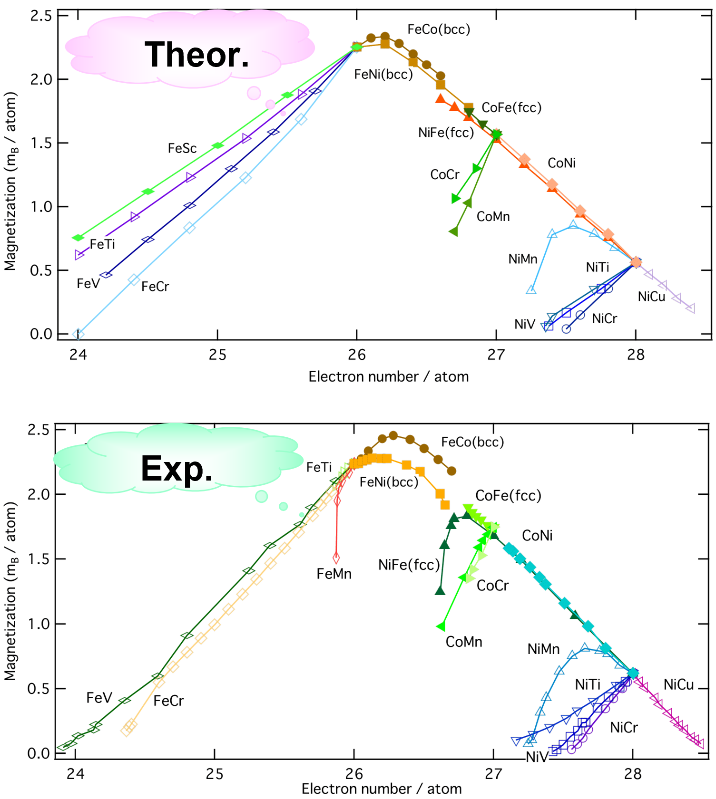

# チュートリアル
## 状態密度(total DOS)を描画する
### インプットファイルの書き換え

これまでインプットファイルの解説に使ってきたものを、DOSを描く用に書き換えて利用してみる。
```dos
c----------------------Fe------------------------------------
c    go   file
     dos  data/fe
c------------------------------------------------------------
c   brvtyp     a        c/a   b/a   alpha   beta   gamma
     bcc      5.27  ,      ,      ,      ,       ,      ,
c------------------------------------------------------------
c   edelt    ewidth    reltyp   sdftyp   magtyp   record
    0.001     1.0       nrl      mjw      mag      2nd
c------------------------------------------------------------
c   outtyp    bzqlty   maxitr   pmix
    update      10        50    0.023
c------------------------------------------------------------
c    ntyp
      1
c------------------------------------------------------------
c   type    ncmp    rmt    field   mxl  anclr   conc
    Fe       1       1      0.0     2
                                          26    100
c------------------------------------------------------------
c   natm
     1
c------------------------------------------------------------
c   atmicx                        type
     0          0          0        Fe
c------------------------------------------------------------
```
変わった点は2点ある。
* go → dos に書き換え
* bzqlty : 4 → 10 大き目の値に変更。20程度に大きくとってもよい。大き目にとったほうがDOSがスムーズになって見た目が良い。

### 実際に状態密度(total DOS)を描画する

ダウンロードしたAkaiKKRプログラムを解凍した際に、AkaiKKRのアウトプットファイルをgnuplotで描画するためのプログラムが収録されている。そのうちの一つが**gpd**である。specxプログラムを実行したのちに、実際に描画してみよう。

```bash:terminal.sh
 > ./specx<in/fe>out/fe
 > gpd out/fe
 ```

 すると、鉄のtotal DOSは次のように描ける。
 


## エネルギー分散曲線(dispersion curve)を書く

インプット第一段落の命令を、状態密度用の命令(dos)からエネルギー分散曲線用(spc)に変更するだけでよい。
```spc
c----------------------Fe------------------------------------
     spc   data/fe
c------------------------------------------------------------
```

specxで計算を実行した後、DOSを描いた時とは別の描画プログラムを利用して、エネルギー分散曲線を描いてみよう。このspcプログラムも、gnuplotを呼び出して描画するものである。

```bash:spc.sh
> spc data/fe_up.spc
> spc data/fe_dn.spc
```



## 異なる結晶構造の計算をしてみる
### コバルトのインプットファイル
コバルトの計算をしたいので、hcp構造についておさらいする。また、コバルトの場合のインプットファイルを掲載している。


```in/Co
c----------------------Co------------------------------------
     go   data/co
c------------------------------------------------------------
c   brvtyp     a        c/a   b/a   alpha   beta   gamma
     hcp      4.74 , 1.6215 ,      ,      ,       ,      ,
c------------------------------------------------------------
c   edelt    ewidth    reltyp   sdftyp   magtyp   record
    0.001     1.0       nrl      mjw      mag      2nd
c------------------------------------------------------------
c   outtyp    bzqlty   maxitr   pmix
    update      4        50    0.023
c------------------------------------------------------------
c    ntyp
      1
c------------------------------------------------------------
c   type    ncmp    rmt    field   mxl  anclr   conc
    Co       1       1      0.0     2
                                          27    100
c------------------------------------------------------------
c   natm
     2
c------------------------------------------------------------
c   atmicx                        type
     0          0          0        Co
     0.5        0.86602    0.81075  Co
c------------------------------------------------------------
```
ここで、いままでになかった**atmicx**の表現方法が現れる。下の行に描かれているのが、格子定数aを単位とした原子位置のカーテシアン座標となる。

次のように、分数で表現することもできる。
```in/Co
c------------------------------------------------------------
c   atmicx                        type
     0          0          0        Co
     1/2        0.86602    0.81075  Co
c------------------------------------------------------------
```
さらに、単位格子ベクトルa,b,cを用いて位置を指定することも出来る。
このように書くと x, y, z 軸方向に取った直方体の稜ベクトルで原子位置を指定したことになる。
```
c------------------------------------------------------------
c   atmicx                        type
     0x         0y         0z       Co
     1/2x       0.86602y   1/2z     Co
c------------------------------------------------------------
```

## 不純物問題
母体のグリーン関数は次のように書かれる。

母体原子の一つが不純物原子に置き換わったときの散乱を考える。

## CPA(コヒーレント・ポテンシャル近似)
置換型不規則合金のマクロな物性は**原子に関する配置平均をとった結果**として表される。このような配置平均をとったあとの状態を再現する仮想原子に対応した t 行列（コヒーレント t 行列、下図右）を考える。



コヒーレント t 行列は次の関係を満たす。


シングルサイト近似になる。コヒーレントポテンシャルがセルフコンシステントに定まるまでバンド計算を回すので、通常の電子状態計算よりは時間がかかる。


## NiFe合金(fcc)
Ni原子をFe原子で置き換えていく。
最終的にガンマ鉄になる様を計算する。


合金の場合のインプットファイルは、例えば次のようになる。
```in/NiFe
c----------------------NiFe----------------------------------
     go   data/nife
c------------------------------------------------------------
c   brvtyp     a        c/a   b/a   alpha   beta   gamma
     fcc      6.55  ,      ,      ,      ,       ,      ,
c------------------------------------------------------------
c   edelt    ewidth    reltyp   sdftyp   magtyp   record
    0.001     1.0       nrl      mjw      mag      2nd
c------------------------------------------------------------
c   outtyp    bzqlty   maxitr   pmix
    update      4        50    0.023
c------------------------------------------------------------
c    ntyp
      1
c------------------------------------------------------------
c   type    ncmp    rmt    field   mxl  anclr   conc
    NiFe      2       1      0.0     2
                                          26     80
                                          28     20
c------------------------------------------------------------
c   natm
     1
c------------------------------------------------------------
c   atmicx                        type
     0          0          0        NiFe
c------------------------------------------------------------
```

**type**には、タイプの名前をつける。**ncmp**が2なのは、このタイプの位置を占める原子の種類は2個であることを示している。原子の種類**anclr**はFe 26、Ni 28、この位置を占める確率**conc**がそれぞれ80%と20%である。このconcを調整して様々な合金の計算を行ってみよう。
もちろん**type**(以前のバージョンではtypeとatmtyp)aの間には対応が取れている必要がある。
この合金のFeの割合を変化させてtotal DOSをプロットさせると、次のようになる。


## スレータ・ポーリング曲線
Fe, Co, Niなどの遷移金属元素からなる合金
磁気モーメントは共通の曲線上にのる
計算は実験的にえられている結果を枝分かれの状況も含めて良く再現する.


* H. Akai, Hyperfine Interactions 68 (1991) 3
* H.P.J. Wijn,  Magnetic Properties of Metals (1991)


## Input file for dispersion curve
```
c----------------------Inpurity inFe-------------------------
     go   data/feX
c------------------------------------------------------------
c   brvtyp     a        c/a   b/a   alpha   beta   gamma
     bcc      5.27  ,      ,      ,      ,       ,      ,
c------------------------------------------------------------
c   edelt    ewidth    reltyp   sdftyp   magtyp   record
    0.001     1.0       nrl      mjw      mag      2nd
c------------------------------------------------------------
c   outtyp    bzqlty   maxitr   pmix
    update      4        50    0.023
c------------------------------------------------------------
c    ntyp
      1
c------------------------------------------------------------
c   type    ncmp    rmt    field   mxl  anclr   conc
    FeX      2       1      0.0     2
                                          26    100
                                           1      0
c------------------------------------------------------------
c   natm
     1
c------------------------------------------------------------
c   atmicx                        type
     0          0          0        FeX
c------------------------------------------------------------
```
**conc**の下段をみると、確率(濃度)はゼロである。

## 参考文献
* Reference
  * 計算機ナノマテリアルデザイン入門（笠井秀明・赤井久純・吉田博編　大阪大学出版会）
  * W.Kohn and N. Rostoker, Phys. Rev. 94 (1954) 1111.
  * F.S. Ham and B. Segall, Phys. Rev. 124 (1961) 1786.
  * H. Akai, J. Phys. Soc. Japan 51 (1982) 468.
  * H. Akai, J. Phys.: Cond. Matter 1 (1989) 8045.

* KKR パッケージ　http://kkr.issp.u-tokyo.ac.jp/
