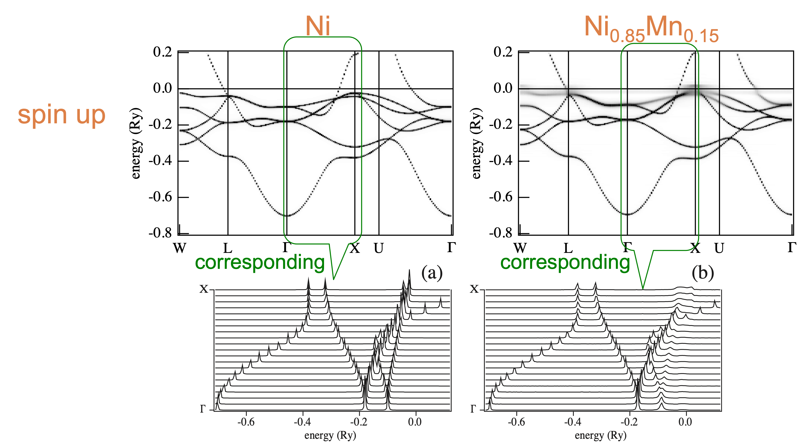
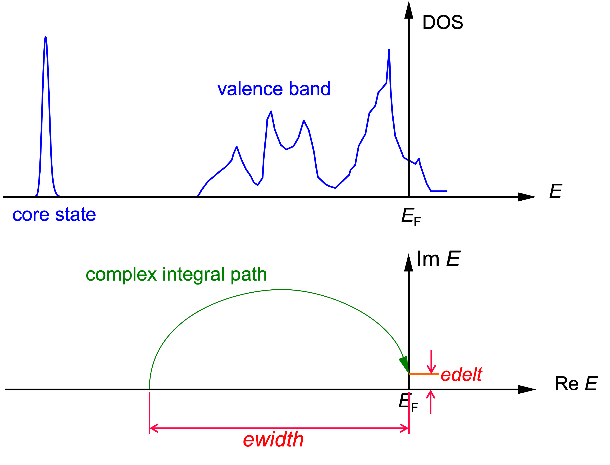

# Notes on AkaiKKR input files

## Composition of input files

Input files mainly contain information about the crystal lattice. 
First, an example of input file description is as follows:

```in/fe
c----------------------Fe------------------------------------
c    go   file
     go   data/fe
c------------------------------------------------------------
c   brvtyp     a        c/a   b/a   alpha   beta   gamma
     bcc      5.27  ,      ,      ,      ,       ,      ,
c------------------------------------------------------------
c   edelt    ewidth    reltyp   sdftyp   magtyp   record
    0.001     1.0       nrl      mjw      mag      2nd
c------------------------------------------------------------
c   outtyp    bzqlty   maxitr   pmix
    update      4        50    0.023
c------------------------------------------------------------
c    ntyp
      1
c------------------------------------------------------------
c   type    ncmp    rmt    field   mxl  anclr   conc
    Fe       1       1      0.0     2
                                          26    100
c------------------------------------------------------------
c   natm
     1
c------------------------------------------------------------
c   atmicx                        type
     0          0          0        Fe
c------------------------------------------------------------
```

In this file, **lines starting with c or # are comment lines**, so they are not read for calculations. Therefore, **blank lines are skipped.**
Although different from this example, when we write multiple inputs in a file, the calculations are performed sequentially. 
On the other hand, if we write **end** in an uncommented out line, subsequent descriptions are not
read.

If we remove commented or blank lines, this input file will look like this. The program reads input files like this.

```in/fe
go   data/fe

bcc      5.27  ,      ,      ,      ,       ,      ,
0.001     1.0       nrl      mjw      mag      2nd
update      4        50    0.023
1
Fe       1       1      0.0     2
                                          26    100
1
0          0          0        Fe
```

Make sure that comment lines or keywords are written for readability.
**In the program, data is separated by 1 or more spaces or a comma**.
Consecutive spaces have the same meaning as one space. The same is true for line breaks.
In addition, we can use line breaks anywhere.
The following shows the input file with some spaces and line breaks removed.

```in/fe
go data/fe bcc 5.27,,,,,,0.001 1.0 nrl mjw mag 2nd
update 4 50 0.023 1 Fe 1  1  0.0 2 26 100
1 0 0 0 Fe
```
Sequential data arrays are read for input data, so we just have to follow the order of writing.
Almost all **data and keywords are optional**, but we must **add commas for data separation to indicate omission**.
On the other hand, we do not need to prepare inputs as files. In fact, we can perform calculations by typing in the standard input from our keyboard when we run the AkaiKKR program on a terminal.

```direct_input
> specx (or ./specx, run specx, etc.)
go
data/fe
bcc 
5.27,,,,,,
0.001 1.0 nrl mjw mag 2nd
update 4 50 0.023 1 Fe 1  1  0.0 2 26 100
1 0 0 0 
Fe
(calculation starts)
...
Ctl-d
>
```
In practice, it would be more convenient to prepare an input file for the calculation.

## Keywords description

We explain keywords here. This explanation is based on the assumption that the input file is divided into parts by comment lines.

```in/fe
c----------------------Fe------------------------------------
c    go   file
     go   data/fe
c------------------------------------------------------------
c   brvtyp     a        c/a   b/a   alpha   beta   gamma
     bcc      5.27  ,      ,      ,      ,       ,      ,
c------------------------------------------------------------
c   edelt    ewidth    reltyp   sdftyp   magtyp   record
    0.001     1.0       nrl      mjw      mag      2nd
c------------------------------------------------------------
c   outtyp    bzqlty   maxitr   pmix
    update      4        50    0.023
c------------------------------------------------------------
c    ntyp
      1
c------------------------------------------------------------
c   type    ncmp    rmt    field   mxl  anclr   conc
    Fe       1       1      0.0     2
                                          26    100
c------------------------------------------------------------
c   natm
     1
c------------------------------------------------------------
c   atmicx                        type
     0          0          0        Fe
c------------------------------------------------------------
```

### Part1. Perform Calculation

```in/fe
c----------------------Fe------------------------------------
c    go   file
     go   data/fe
c------------------------------------------------------------
```

#### go : type of calculation performed

This parameter determines the type of calculations to be performed.
The following options are available:

* go : starts the SCF calculation
* dos : DOS calculation
* spc : energy dispersion calculation
* ngo : do nothing
* dsp : display existing results

The meanings of the main abbreviations are SCF (self-consistent field), dos (density of states), spc (Bloch spectral function).

#### file : place that storage used data

We can specify any files or directories, even non-existing files.
When we first download and decompress AkaiKKR, we have nothing in the data directory. 
The data directory should be considered as a commonly used place to store calculation results.

When we have a file, the following appears in the output: 
```
file to be accessed=data/fe


```

When the specified file does not exist, the following appears: 
```
file to be accessed=data/fe

created
```
and a file with the same name is generated.
For example, we first run an SCF calculation with the **go** option, and create a new file, then we can run a **dos** calculation by using the file created by the SCF calculation. 

##### Bloch spectral function

We provide a brief supplement on Bloch functions.
For example, Bloch spectral functions for Ni and Ni/Mn alloy are as follows:


Energy Dispersions are as follows:


Taking the corresponding between Bloch spectral functions and energy dispersions, we get the following:


### Part2. Determine the crystal structure

Keywords indicating the crystal structure are in the row.

```in/fe
c------------------------------------------------------------
c   brvtyp     a        c/a   b/a   alpha   beta   gamma
     bcc      5.27  ,      ,      ,      ,       ,      ,
c------------------------------------------------------------
```
#### brvtyp : Bravais lattice

The following structures are available:

* options
  * fcc : face centered cubic
  * bcc：body centered cubic
  * hcp (hex) : hexagonal closed packed
  * sc : simple cubic
  * bct : body centered tetragonal
  * st : simple tetragonal
  * fco : face centered orthorhombic
  * bco : body centered orthorhombic
  * bso : base centered orthorhombic
  * so : simple orthorhombic
  * bsm : base centered monoclinic
  * sm : simple monoclinic
  * trc : triclinic
  * rhb(trg) : rhombohedral(trigonal)
  * fct : face centered tetragonal

We can specify various options, and **we can leave it blank if we do not know**
whether AkaiKKR contains database of crystal structures, so **if brytypw is empty, it will be correctly determined by this database**.

#### a : lattice constant a

If we do not know, we can also leave this blank. This is because AkaiKKR can refer to a database within the code.
Also, **Slater atomic units are used for this code**, and the unit for length is bohr.  

* length : 1 bohr ≃　0.529 Å
* energy : 1 Ry ≃ 13.6 eV

For example, if brvtyp is bcc, the parameters (c/a, b/a, α, β, γ) are determined (1, 1, 90 , 90, 90), so we can leave these parameters blank by using commas.

### Part3. Complex integral

```in/fe
c------------------------------------------------------------
c   edelt    ewidth    reltyp   sdftyp   magtyp   record
    0.001     1.0       nrl      mjw      mag      2nd
c------------------------------------------------------------
```
We should carefully determine **edelt** and **ewidth**. Both parameters have the unit Ry.



* edelt : ~0.001 Imaginary part added to Fermi energy.
* ewidth : width of Energy Contour. This indicates how much width is used for integration.

Failure of calculations is due to improper settings for these parameters.

For **edelt**, the function calculated by this program does not define a Green function because the positive real axis of the upper complex energy plane is a branch cut. Therefore, the Green function at real energy is defined as the limit of the imaginary part of the complex plane approaching the real axis from the positive side.
For numerical calculations, a finite imaginary part is given, and its size is the edelt. Conversely, if edelt is made small, a large number of k-points are required, but if a sufficiently large number of k-points are taken, the accuracy will be high. Therefore, it is necessary to "find an appropriate value," and the default value of 0.001Ry is a safe value to start with.

**ewidth** is determined as follows.
In the above figure, it is safe to set the ewidth to be in the middle of the core state and the valence band. However, since the positions of the core state and the valence band are not known in advance, the ewidth may be set to an inappropriate width. In this case, the calculation will fail, so it is necessary to set the ewidth carefully.

Specifically, the Fermi energy minus the ewidth is the lower limit of the energy integral, determined so that the lower limit is well below the bottom of the valence band (above 0.1 Ry) and well above the shallow core level (above 0.1 Ry).

**reltyp** determines how relativity is treated. 
For heavy atoms, the electrons must be treated according to the theory of relativity, because the velocity of the electrons around the nucleus is very large, and some problems should be treated relativistically even for light atoms. Specify one of the following keywords

* nrl : non relativistic. Relativistic effects are not included at all.
* sra : scaler relativistic. It includes relativistic effects except spin-orbit coupling, which is called scalar relativistic.
* scals : Spin-orbit coupling is included in addition to sra.

**sdftyp** determines the LDA/GGA functional to be used. The exchange correlation potential options are as follows.
* mjw : Morruzi-Janak-Wiliams
* vbh : von Berth-Hedin
* vwn : Vosko-Wilk-Nusair
* gga91 : generalized gradient approximation 91
* pbe : Perdew-Burke-Ernzerhof

**magtyp** determines how magnetism is treated.
* mag : magnetic. Spins are included.
* nmag : non magnetic
* lmd : local moment disordered state

**record**  is the keyword for the use of potential data.
Two sets of data (the latest results and the previous results) are stored so that we do not lose results in case of abnormal termination. 
* init : New potential data (Use potential data calculated from given atomic positions)
* 2nd : Continue calculations from the latest potential data
* 1st : Continue calculations from the previous data

### Part4. Specification for data storage and parameter convergences

```in/fe
c------------------------------------------------------------
c   outtyp    bzqlty   maxitr   pmix
    update      4        50    0.023
c------------------------------------------------------------
```

**outtyp** is the keyword for saving potential data.
* update : Update potential data
* quit : Do not save

After this, we need to set the parameter values.
* bzqlty : Brillouin Zone Quality. It controls the size of mesh. This value is dimensionless and is equal to the value of n when the Brillouin zone is divided into n equal parts from the gamma point (0, 0, 0) to the point ka/2 (ka is the unit reciprocal lattice vector). 
* maxitr : The maximum iteration in the iterative calculation.
* pmix : The parameter used in Chebyshev acceleration and Broyden acceleration. Details are described later.

The value of bzqlty is important. For example, if we do not set this value to more than 20 in DOS drawing, we may not get a smooth enough band.

**pmix** is the parameter for mixing of potentials. For example, it is set as follows.
* 0.023 : First Chebyshev, then Broyden
* 0.023tch : Only Chebyshev
* 0.023bry : Only Broyden
* 0.023tchbry : same as 0.023, first Chebyshev, then Broyden

The number 0.023 used here is the convergence control parameter, and the convergence is faster when pmix is larger.
For simple systems, about 0.035 is fine, but for larger systems, it can be 0.001 or less.

### Part5. Number of types

```in/fe
c------------------------------------------------------------
c    ntyp
      1
c------------------------------------------------------------
```
**ntyp** is the number of different types of sites, i.e., the number of sites that are not crystallographically equivalent. It refers to the number of independent site types in the unit lattice.

### Part6. Features of sites

```in/fe
c------------------------------------------------------------
c   type    ncmp    rmt    field   mxl  anclr   conc
    Fe       1       1      0.0     2     26    100
c------------------------------------------------------------
```

* type : An arbitrary name for each type. It represents the name of the individual site type.
* ncmp : The number of atoms occupying the positions specified by type
* rmt : The muffin tin radius whose unit is the lattice constant a. The length unit of the lattice constant a is bohr. If we set the value to 0, it is automatically determined. 
* field : The external field represented by Zeeman energy. The unit is Ry. 1Ry = 2.351x10^5 T

* mxl : As the angular momentum increases, the t-matrix of scattering rapidly approaches zero. The t-matrix with angular momentum less than mxl is assumed to be nonzero.
* anclr : The atomic number occupying the positions specified by type. 0 means that a vacant point is placed. 
* conc : The probability or concentration of an atom occupying a position of that type. The concentration is normalized within the site so the sum can be any amount.

In addition to **rmt** (the muffin tin radius), it may be specified as zero or omitted unless it is intentionally set. When there are several different atoms in a unit cell, the appropriate value is set by referring to the ionic radius database provided in the code.

About the value of **field**, if we want to specify the magnetic structure like antiferromagnetics, we should set it to about 0.05 at the beginning of the iterative calculation until the direction of the magnetic moment stabilizes.

If we set **mxl** to 2, d-waves scattering is also taken into account. For a more accurate calculation, set it to 3, and f-wave scattering will be taken into account.

### Part7.　Number of atoms per unit cell

```in/fe
c------------------------------------------------------------
c   natm
     1
c------------------------------------------------------------
```

* natm : Number of atoms per unit cell (Number of different positions of the atoms)

### Part8.　Positions and types of atoms

```in/fe
c------------------------------------------------------------
c   atmicx                        type
     0          0          0        Fe
c------------------------------------------------------------
```

* atmicx : Atomic position. Position vector. It is based on the unit lattice a, and the unit of length of the unit lattice is bohr. It can be written in two ways. The first is by Cartesian coordinates, for example, 0.5, 0.5, 0.5, etc., and the second is by basis vectors, for example, 0.5a, 0.5b, 0.5c, etc.
* type : The name of the type that occupies the position.

The **type** here must correspond to the **type** in Part6. In the old version, the name **atmtyp** is used, however, these value are actually the same, so **atmtyp** is replaced by **type** in the update of the beginning of 2022 (cpa2021.tgz January 15, 2023 [ 13:36:45 ]).