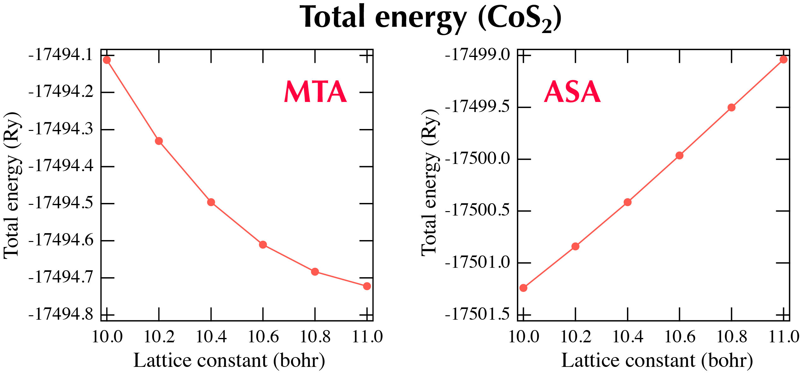
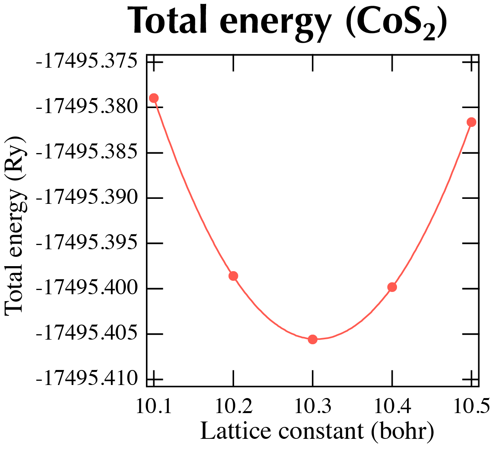

# FPKKR

拡張機能をご使用になりたい場合はアカデメイアまで[お問い合わせ](https://www.academeia15.co.jp/akaikkrform)下さい。

## 概要

KKR法ではマフィンティン型ポテンシャルを用い、多重散乱によるグリーン関数を求めるが、FPKKR(フルポテンシャルKKR)法1,2)では全空間を敷き詰めるボロノイセルを用いてグリーン関数を求める。

## 実行方法

実行の際にはFPKKRが組み込まれたコードを使用する。inputに関してはKKR法のものと同様のものを用いる。実行方法もKKR法のときと変わらない。

標準出力により表示される結果については、実際に計算が始まるまでにボロノイセルとそれに付随した多くの種類の動径メッシュの情報が出力されるが、SCF計算の後はほぼ同じである。ただしdistributionバージョンでは超微細磁場などの情報は出力されない。

## KKR法とFPKKR法の結果の比較

ここでは、隙間が多く非当方的な構造を取るパイライト型化合物MX2(M=遷移金属、X=Sなど)の結果を示す。

KKR法により得られる格子定数に対するCoS2の全エネルギーを示すが、MTA(Muffin-Tin Approximation)とASA(Atomic Sphere Approximation)のいずれも最小値を取らない3)。

{: style="width: 636px; max-width: 100%; height: auto;"}

一方FPKKR法により得られた格子定数に対する全エネルギーは最小値を持ち、その値は実験値を再現する4)。

{: style="width: 321px; max-width: 100%; height: auto;"}

## 参考文献

1. B. Drittler et al, Phys. Rev. B 42 (1990) 9336.

2. M. Ogura and H. Akai, J. Phys.: Cond. Matter 17 (2005) 5741.

3. H. Yamada et al, JMMM 177-181 (1998) 607.

4. M. Ogura and H. Akai, J. Phys.: Cond. matter 19 (2007) 365215.