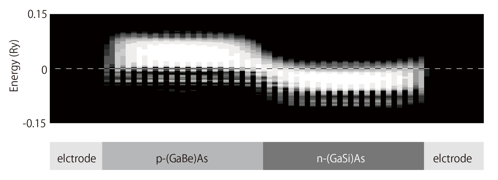

# 遮蔽KKR

拡張機能をご使用になりたい場合はアカデメイアまで[お問い合わせ](https://www.academeia15.co.jp/akaikkrform)下さい。

## 概要

遮蔽KKR法は、格⼦点上のマフィンティンポテンシャルを導⼊した遮蔽変換を実施する事で、グリーン関数が距離について指数関数的に減少するようにした⼿法である。これにより精度を落とさずに⾼速化が可能となり、通常O(N<sup>3)</sup>)が必要な電⼦状態計算をO(N)で実施する事ができる。遮蔽KKR法は不純物や界⾯などの不均⼀系にも適⽤可能であり、磁気的性質や輸送現象の計算にも適⽤できる。

計算適用例としてp型(Ga<sub>1-x</sub>Be<sub>x</sub>)Asとn型(Ga<sub>1-x</sub>Si<sub>x</sub>)Asの接合の電⼦状態計算を示す<sup>1)</sup>。接合部分のポテンシャルには勾配があり、空乏層ができている事が分かる。
{: style="width: 636px; max-width: 100%; height: auto;"}

## 実行方法

実行の際には遮蔽KKR法が組み込まれたコードを使用する。以下にinputについて、Feの例を示す。c/aを2としてユニットをz軸方向にのばしており、それに応じて原子数を2の倍数にしている。なお、標準出力により表示される結果については、遮蔽KKR法を用いない通常の計算とほぼ同じである。

```
c----------------------Fe------------------------------------
c    go   file
     go   data/fe
c------------------------------------------------------------
c   brvtyp     a        c/a   b/a   alpha   beta   gamma
     bcc      5.27  ,    2  ,      ,      ,       ,      ,
c------------------------------------------------------------
c   edelt    ewidth    reltyp   sdftyp   magtyp   record
    0.001     1.0      srals     mjw      mag      2nd
c------------------------------------------------------------
c   outtyp    bzqlty   maxitr   pmix
    update      4        50    0.023
c------------------------------------------------------------
c    ntyp
      1
c------------------------------------------------------------
c   type    ncmp    rmt    field   mxl  anclr   conc
    Fe       1       0       0      2
                                          26    100
c------------------------------------------------------------
c   natm
     4
c------------------------------------------------------------
c   atmicx                        type
   0.00000x   0.00000y   0.00000z   Fe
   0.50000x   0.50000y   0.25000z   Fe
   0.00000x   0.00000y   0.50000z   Fe
   0.50000x   0.50000y   0.75000z   Fe
c------------------------------------------------------------
```

## 参考文献

1. T. Nagata, S. Yotsuhashi and H. Akai, J. Phys. Soc. Jpn. 81, SB066 (2013).